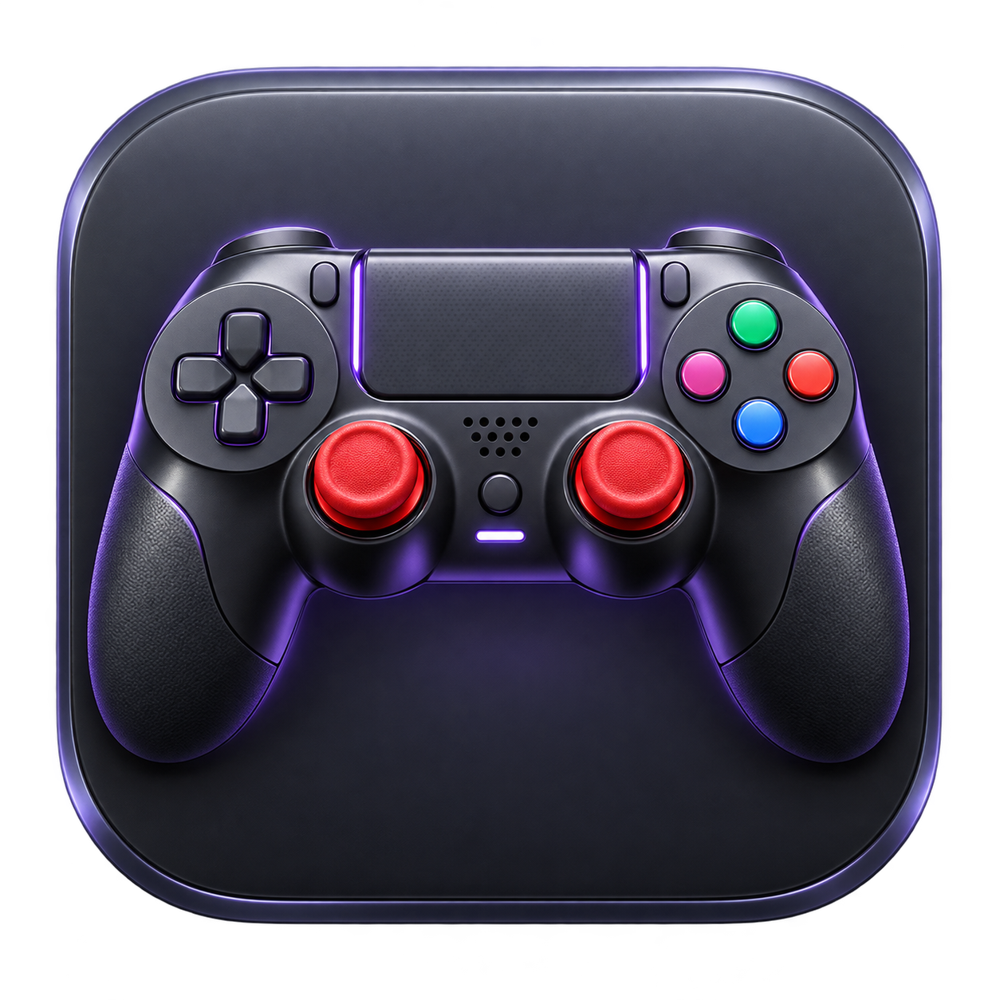
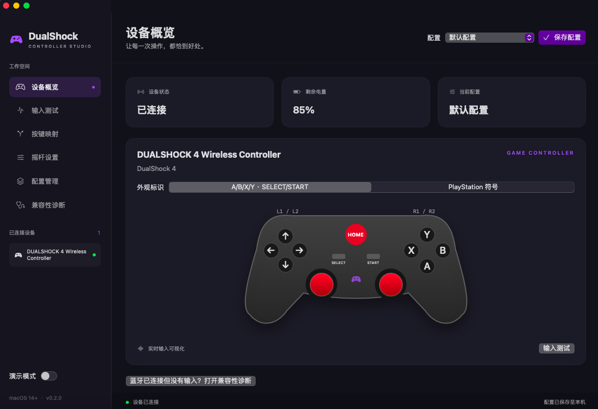

# DualShock



面向 **macOS 14.0+（目标系统 14.7.2）** 的原生游戏手柄管理与配置应用，使用 SwiftUI 和 Apple Game Controller 框架，无第三方运行时依赖。支持 Apple Silicon 与 Intel Mac。

## 实机截图

用户提供的 macOS 实际运行截图：手柄已连接，电量 85%，演示模式关闭。



示例图片保存在 [`docs/images`](docs/images)，原始软件图标为 [`Resources/Artwork/AppIcon.png`](Resources/Artwork/AppIcon.png)。构建会生成 macOS `.icns` 与 1024 像素 PNG；可在 Actions 的 `DualShock-icons` artifact 中单独下载。图标制作提示词与生成方式见 [图标说明](Resources/Artwork/README.md)。

## 当前功能

- 自动枚举、切换和监测连接/断开的手柄，支持系统识别的扩展游戏手柄。
- 实时显示按键、方向键、双摇杆与模拟扳机输入；读取设备提供的电池信息。
- 深色中文界面，包含设备概览、输入测试、按键映射、摇杆设置和配置管理。
- 按键映射预设、径向死区、灵敏度与 Y 轴反转，实时查看处理后的输入。
- 支持设备的 LED 颜色设置；不支持的设备禁用应用按钮。
- 配置本地持久化、复制、删除及 JSON 导入/导出。导入校验参数范围，写入采用原子操作。
- 明确标记的演示模式，无手柄也能检查界面和配置处理。
- A/B/X/Y + SELECT/START/HOME 外观标识，或 PlayStation 符号；仅改变示意图，不假定硬件型号。
- “兼容性诊断”页通过 IOKit 枚举 HID 游戏手柄，显示 VID/PID、传输方式、输入元素和原始数值，支持 JSON 诊断导出。

**作用范围：** 按键映射和摇杆参数只影响本应用的输出预览，不会向其他游戏注入输入，也不会更改手柄固件。LED 应用按钮会控制选中设备的灯光。当前不提供虚拟手柄驱动、全局键鼠映射、固件升级、自适应扳机或震动控制；若需要这些功能，需要独立实现并进行真机验证。

## 构建与运行

在 macOS 14.7.2 上安装支持 macOS 14 的 Xcode / Command Line Tools：

```bash
xcode-select --install
git clone https://github.com/hjw21century/DualShock.git
cd DualShock
swift test
bash scripts/build-app.sh
open dist/DualShock.app
```

也可以用 Xcode 打开 `Package.swift`，选择 DualShock scheme 后运行。打包脚本构建 arm64 / x86_64 通用二进制，并生成 `.app` 与 ZIP。GitHub Actions 在每次提交时执行测试、构建并上传安装包 artifact。

构建产物采用本地 ad-hoc 签名，尚未使用 Developer ID 签名或公证。首次打开下载的产物时，macOS 可能需要在“系统设置 → 隐私与安全性”中允许打开。正式分发需配置开发者签名与 Apple 公证。

## 使用

1. USB 数据线连接手柄，或在系统蓝牙设置中先完成配对；设备会自动出现在侧栏。
2. 选择设备，在“输入测试”中检查原始输入。系统或设备不提供的电量显示“电量未知”。
3. 调整映射与摇杆参数，观察应用内输出预览；点击“保存配置”或按 `⌘S` 保存。
4. 灯光支持取决于设备与系统。选择颜色后点击“应用到手柄”，配置切换不会自动改变硬件灯光。
5. 在“配置管理”复制或导入配置；切换时会保存当前修改，退出前请主动保存。

配置保存在 `~/Library/Application Support/DualShock/Profiles/`。不能解析的文件会保留并报错，不会静默覆盖。

## 项目结构

```text
Sources/ControllerCore/       配置模型、输入变换、导入校验
Sources/DualShock/            SwiftUI 界面、设备发现与输入采样、配置存储
Tests/ControllerCoreTests/    死区、归一化、反转、配置往返与非法输入测试
Resources/Info.plist          macOS 应用信息
scripts/build-app.sh          通用 .app 打包脚本
.github/workflows/macos.yml   macOS 测试与构建
```

## 验证范围

开发环境为 Linux，无法在本机运行 Apple 框架或进行 macOS 真机测试。macOS 编译结果以仓库 Actions 为准。发布前请在 macOS 14.7.2 验证：USB/蓝牙接入、断开重连、多手柄切换、休眠唤醒、电池信息、灯光控制，以及配置保存后重启恢复。

## 图中手柄与兼容性诊断

用户补充的图片显示系统蓝牙名称为 `DUALSHOCK 4 Wireless Controller`，实体面板为 A/B/X/Y、SELECT/START/HOME 和红色双摇杆。应用默认示意图使用该面板布局，仍可切换 PlayStation 符号。蓝牙名称不能证明设备型号或协议；灯光、HOME 按键等能力取决于系统实际公开的接口。

若蓝牙显示连接成功，但设备概览没有手柄或按键没有响应：

1. 打开“兼容性诊断”，选择检测到的 HID 接口。
2. 依次按 A/B/X/Y、SELECT/START，移动左右摇杆和方向键，观察原始值及更新计数。
3. 若系统提示权限问题，在“隐私与安全性 → 输入监控”中允许 DualShock，然后退出并重开应用。
4. 导出 JSON 诊断报告，供后续确认 Button 编号和轴对应关系。报告不包含设备序列号。

诊断仅匹配 Generic Desktop 的 Joystick/Game Pad，不匹配键盘和鼠标，不独占设备，不发送输出报告。未收到值显示“未收到”，不会伪造零值。轴归一化按 HID 描述符逻辑范围计算，并不代表已校准的游戏摇杆。未知 HID 协议目前只提供诊断，不自动接入主界面映射；仍需该设备的实际输入报告才能可靠适配。

框架参考：[Apple GCController](https://developer.apple.com/documentation/gamecontroller/gccontroller)、[设备灯光](https://developer.apple.com/documentation/gamecontroller/gcdevicelight)。

HID 参考：[Apple IOHIDManager 输入回调](https://developer.apple.com/documentation/iokit/1438367-iohidmanagerregisterinputvalueca)。
